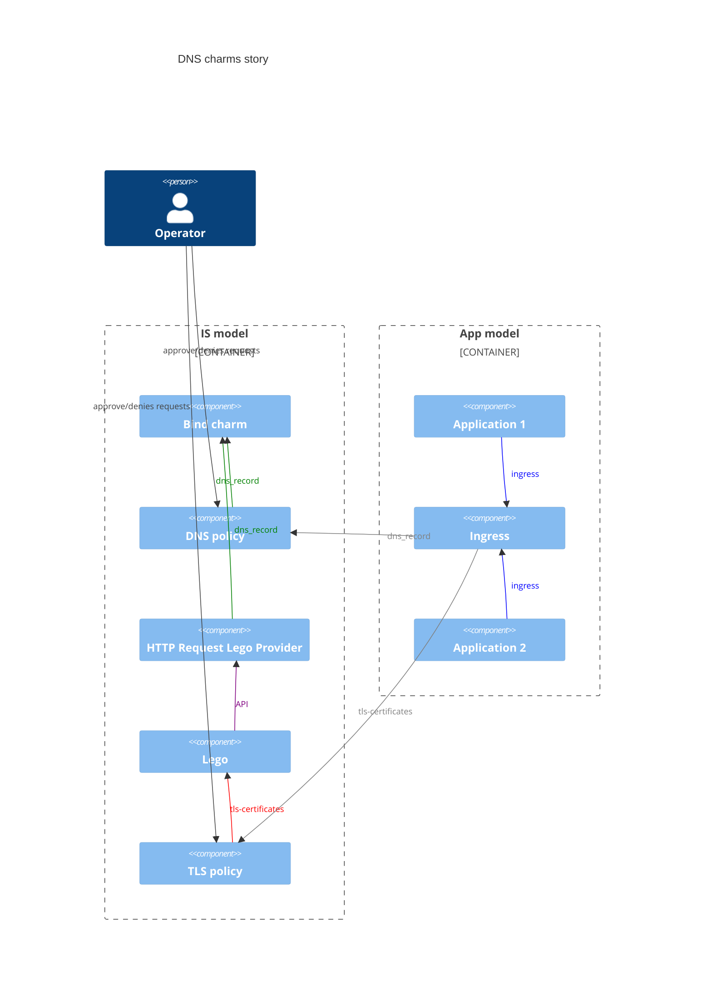

```mermaid
C4Context
title DNS charms story

Container_Boundary(is-model, "IS model") {
  
  Component(bind, "Bind charm")
  Component(dns-policy, "DNS policy")

  Rel(dns-policy, bind, "dns_record")
  UpdateRelStyle(dns-policy, bind, $textColor="green", $lineColor="green", $offsetX="-20", $offsetY="10")

  Component(httpreq, "HTTP Request Lego Provider")
  Component(lego, "Lego")
  Component(tls-policy, "TLS policy")

  Rel(httpreq, bind, "dns_record")
  Rel(lego, httpreq, "API")
  Rel(tls-policy, lego, "tls-certificates")
  UpdateRelStyle(httpreq, bind, $textColor="green", $lineColor="green", $offsetX="10")
  UpdateRelStyle(lego, httpreq, $textColor="purple", $lineColor="purple", $offsetY="10")
  UpdateRelStyle(tls-policy, lego, $textColor="red", $lineColor="red")
}

Container_Boundary(app-model, "App model") {
    Component(app-1, "Application 1")
    Component(ingress, "Ingress")
    Component(app-2, "Application 2")

    Rel(app-1, ingress, "ingress")
    Rel(app-2, ingress, "ingress")
    UpdateRelStyle(app-1, ingress, $textColor="blue", $lineColor="blue", $offsetX="10")
    UpdateRelStyle(app-2, ingress, $textColor="blue", $lineColor="blue", $offsetX="10")
}

Rel(ingress, dns-policy, "dns_record")
Rel(ingress, tls-policy, "tls-certificates")
UpdateRelStyle(ingress, dns-policy, $textColor="green", $lineColor="green")
UpdateRelStyle(ingress, tls-policy, $textColor="red", $lineColor="red")

Person(operator, "Operator")
Rel(operator, dns-policy, "approve/denies requests")
UpdateRelStyle(ingress, dns-policy, $textColor="grey", $lineColor="grey", $offsetX="50")

Rel(operator, tls-policy, "approve/denies requests")
UpdateRelStyle(ingress, tls-policy, $textColor="grey", $lineColor="grey", $offsetY="20")

UpdateRelStyle(operator, dns-policy, $offsetY="-40", $offsetX="-60")
UpdateRelStyle(operator, tls-policy, $offsetY="-200", $offsetX="-155")
```
