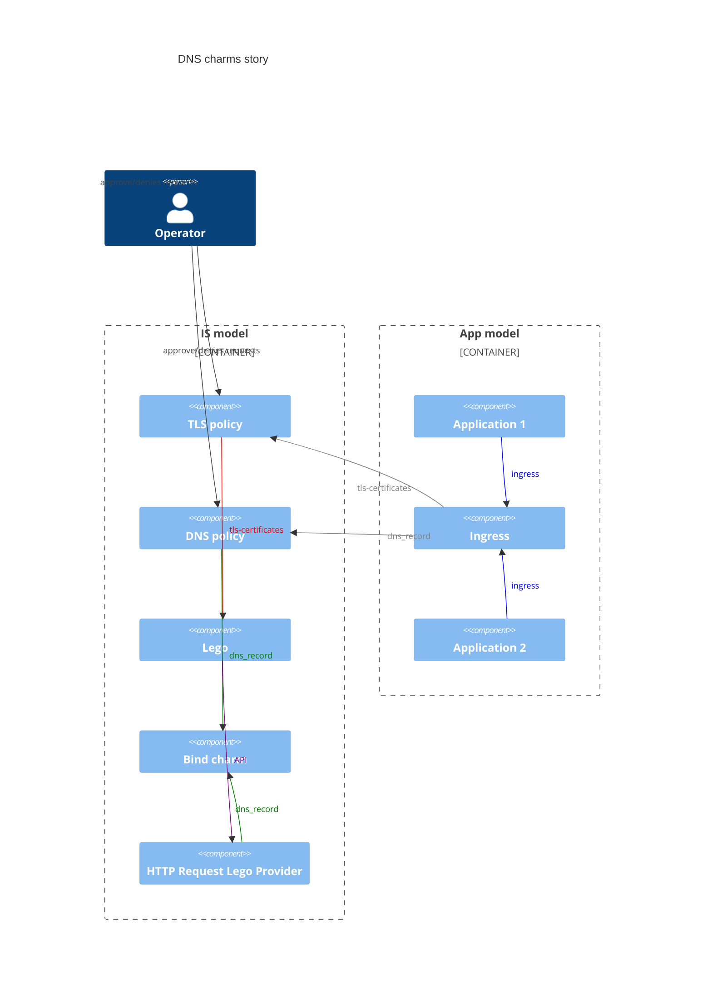

# Charm architecture

DNS operators are a family of charms used to integrate a fully functional DNS solution in [Juju](https://juju.is/).
The core charm is the bind-operator, which acts as a primary DNS server.
The underlying workload uses [Bind](https://bind9.readthedocs.io), packaged as a snap with other tooling to help administer it from the charm perspective.

The following diagram shows how these charms are intended to be used with other charms:



The bind-operator is usually deployed with dns-policy to enable human and/or automated approval of incoming DNS record requests.
The workload of dns-policy is a Django application packaged as a snap with additional tooling. Since both the workloads of bind-operator and dns-policy
are snaps, they can work on the same machine. It was therefore decided to make dns-policy a subordinate charm.

The following diagram shows the interactions between bind-operator, dns-policy, and external components of a typical deployment of the DNS charms:


After having deployed and integrated all the DNS charms in one model, you should see the following output with `juju status --relations`:
```
Model    Controller  Cloud/Region         Version  SLA          Timestamp
machine  lxd         localhost/localhost  3.6.5    unsupported  13:14:27-04:00

App                      Version  Status  Scale  Charm                    Channel      Rev  Exposed  Message
bind                              active      3  bind                     latest/edge   77  no       active
dns-integrator-operator           active      1  dns-integrator-operator                 0  no
dns-policy                        active      3  dns-policy               latest/edge    1  no
postgresql               14.15    active      1  postgresql               14/stable    553  no

Unit                        Workload  Agent  Machine  Public address  Ports          Message
bind/0*                     active    idle   0        10.227.61.237   53/tcp 53/udp  active
  dns-policy/0*             active    idle            10.227.61.237   8080/tcp
bind/1                      active    idle   3        10.227.61.162   53/tcp 53/udp
  dns-policy/1              active    idle            10.227.61.162   8080/tcp
bind/2                      active    idle   4        10.227.61.3     53/tcp 53/udp
  dns-policy/2              active    idle            10.227.61.3     8080/tcp
dns-integrator-operator/0*  active    idle   1        10.227.61.161
postgresql/0*               active    idle   2        10.227.61.146   5432/tcp       Primary

Machine  State    Address        Inst id        Base          AZ  Message
0        started  10.227.61.237  juju-cd7a0a-0  ubuntu@22.04      Running
1        started  10.227.61.161  juju-cd7a0a-1  ubuntu@22.04      Running
2        started  10.227.61.146  juju-cd7a0a-2  ubuntu@22.04      Running
3        started  10.227.61.162  juju-cd7a0a-3  ubuntu@22.04      Running
4        started  10.227.61.3    juju-cd7a0a-4  ubuntu@22.04      Running

Integration provider            Requirer                            Interface          Type         Message
bind:bind-peers                 bind:bind-peers                     bind-instance      peer
bind:dns-record                 dns-policy:dns-record-requirer      dns_record         subordinate
dns-policy:dns-record-provider  dns-integrator-operator:dns-record  dns_record         regular
postgresql:database             dns-policy:database                 postgresql_client  regular
postgresql:database-peers       postgresql:database-peers           postgresql_peers   peer
postgresql:restart              postgresql:restart                  rolling_op         peer
postgresql:upgrade              postgresql:upgrade                  upgrade            peer
```

You can here observe that the DNS policy charm is a subordinate one: it will be deployed on the same machine as the Bind charm as soon as it is related to it.
