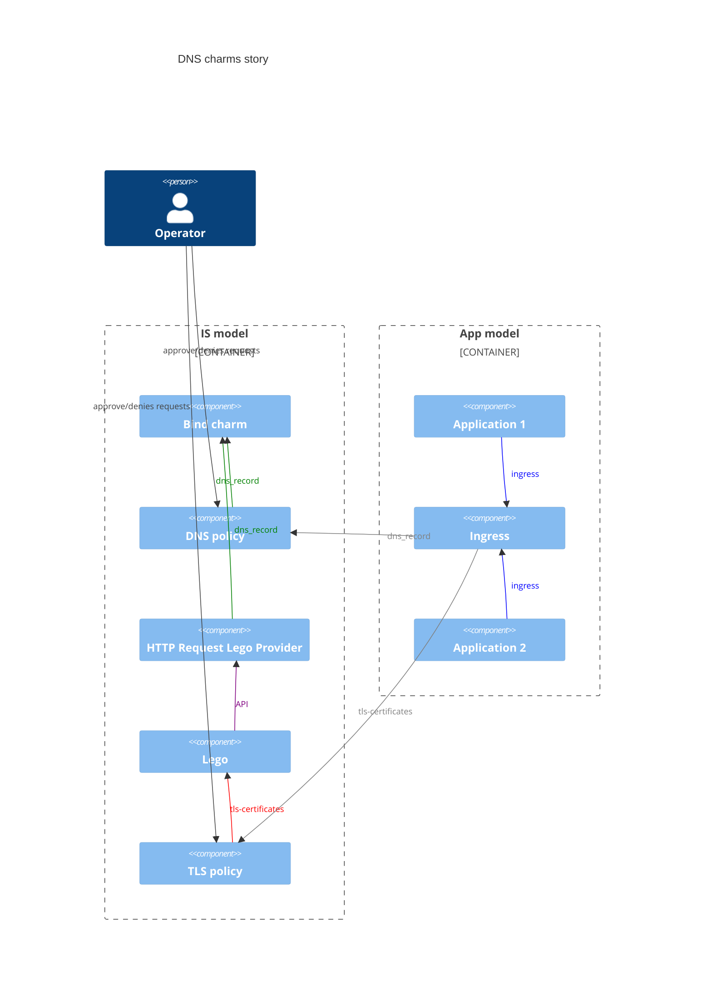
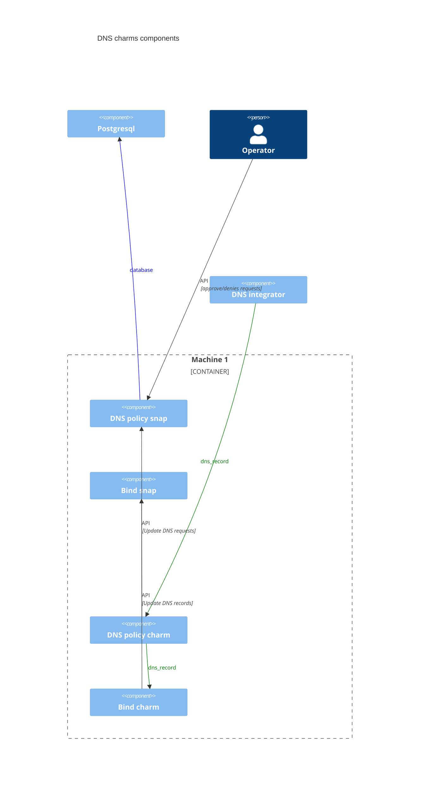

# Charm architecture

DNS operators are a family of charms used to integrate a fully functional DNS solution in Juju.
The core charm is the bind-operator, which acts as a primary DNS server.
The underlying workload uses BIND, packaged as a snap with other tooling to help administer it from the charm perspective.

The following diagram shows how these charms are intended to be used with other charms:

The bind-operator is usually deployed with dns-policy to enable human and/or automated approval of incoming DNS record requests.
The workload of dns-policy is a Django application packaged as a snap with additional tooling. Since both the workloads of bind-operator and dns-policy
are snaps, they can work on the same machine. It was therefore decided to make dns-policy a subordinate charm.

The following diagram shows the interactions between bind-operator, dns-policy, and external components of a typical deployment of the DNS charms:

