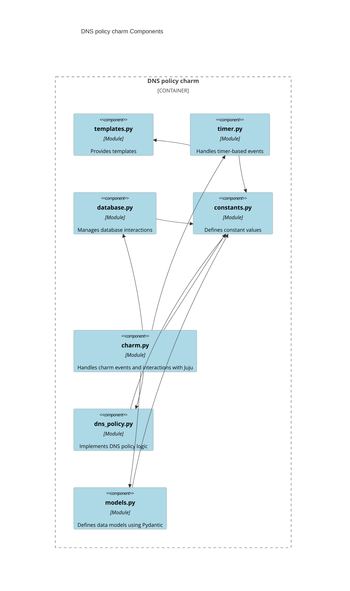

# DNS policy charm architecture

The following diagram shows the different modules of this charm
and how they interact with each other.



## Charm code overview

The `src/charm.py` file is the default entry point for the DNS Policy charm and contains the `DnsPolicyCharm` Python class, which inherits from `CharmBase`. `CharmBase` is the base class from which all charms are formed, defined by the [Ops](https://juju.is/docs/sdk/ops) Python framework for developing charms.

> See more in the Juju docs: [Charm](https://documentation.ubuntu.com/juju/latest/user/reference/charm/)

In the `__init__` method of `DnsPolicyCharm`, the charm sets up observers for various events that are relevant to its operation. This ensures that the charm can respond appropriately to changes in its environment, such as configuration updates or relation changes.

For example, when a user changes the charm's configuration using the Juju CLI, such as by running:

```bash
juju config dns-policy allowed-hosts='example.com'
```

a config-changed event is emitted. The charm's __init__ method has already set up an observer for this event, typically with a line like:
```
self.framework.observe(self.on.config_changed, self._on_config_changed)
```

When the config-changed event occurs, the `_on_config_changed method` is called. This method is responsible for updating the charm's state based on the new configuration. It might involve validating the new configuration, updating the `DnsPolicyConfig` instance with the new settings, and then using the `DnsPolicyService` to apply the new configuration to the workload.

Specifically, the `_on_config_changed` method might first check if all necessary relations, such as the database relation, are ready. If they are, it constructs a `DnsPolicyConfig` object using the current charm configuration and the relation data. Then, it calls the configure method of `DnsPolicyService` to apply this configuration to the DNS policy service running in the container.

This is just one example of how the charm handles events. The `__init__` method sets up observers for other events as well, ensuring that the charm can manage its lifecycle and interactions with other charms and the Juju model effectively.
