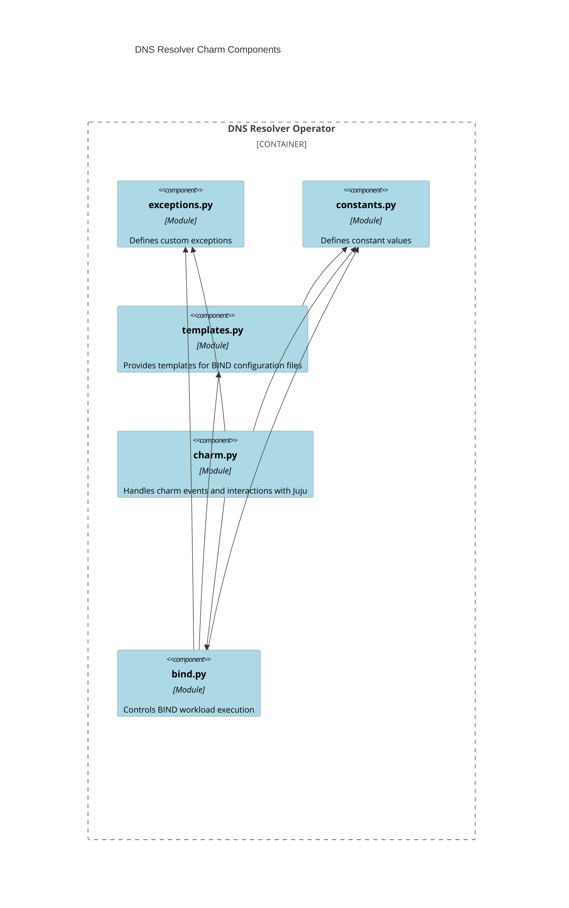

# DNS resolver charm architecture

The following diagram shows the different modules of this charm
and how they interact with each other.



## Charm code overview

The `src/charm.py` file is the default entry point for the DNS Resolver charm and contains the `DnsResolverCharm` Python class, which inherits from `CharmBase`. `CharmBase` is the base class from which all charms are formed, defined by the [Ops](https://juju.is/docs/sdk/ops) Python framework for developing charms.

> See more in the Juju docs: [Charm](https://documentation.ubuntu.com/juju/3.6/user/reference/charm/)

In the `__init__` method of `DnsResolverCharm`, the charm sets up observers for various events that are relevant to its operation. This ensures that the charm can respond appropriately to changes in its environment, such as lifecycle events or relation changes.

The charm uses the `DNSAuthorityRequires` class from the `dns_authority` library to consume DNS authority information from related charms. When a relation with a DNS authority provider is established or updated, the charm's `_reconcile` method is called. This method retrieves the zones and IP addresses of the authoritative DNS servers and uses the `BindService` class to update the BIND configuration accordingly.

For example, when an operator integrates the dns-resolver charm with a bind charm acting as an authority server:

```bash
juju integrate dns-resolver:dns-authority bind:dns-authority
```

The bind charm, acting as the provider, sends its authoritative zones and IP addresses through the relation. The dns-resolver charm receives this data via the `dns_authority_relation_changed` event, which triggers the `_reconcile` method.

The `_reconcile` method retrieves the relation data:
```python
data = self.dns_authority.get_relation_data()
```

If the data contains both zones and addresses, the method calls:
```python
self.bind.update_config_and_reload(data.zones, [str(a) for a in data.addresses])
```

This updates the BIND configuration to forward DNS queries for the specified zones to the authority servers, making the dns-resolver charm act as a forwarding resolver for those zones while maintaining recursive resolution capabilities for all other queries.

## Workload

The workload of this charm is the charmed-bind snap, the same snap used by the bind-operator charm. The workload is operated through the `src/bind.py` module, specifically the `BindService` class, which is able to install the snap, start, stop, restart, and update the BIND configuration files.

The charm configures BIND to operate as a recursive DNS resolver with zone forwarding capabilities. It generates three main configuration files:

1. **named.conf.options**: Configures BIND with recursion enabled, allowing it to resolve any DNS query
2. **named.conf.local**: Defines zone forwarding rules for zones managed by the authority servers and includes a local `service.test` zone for health checks
3. **db.service.test**: A zone file for the internal service zone used for monitoring

Unlike the bind-operator charm which runs BIND as an authoritative server, the dns-resolver charm configures BIND as a recursive resolver that forwards specific zones to upstream authoritative servers while handling all other queries through standard DNS recursion.

The workload doesn't communicate with the charm directly. It merely executes the charm's configuration changes through file updates and service reloads.
